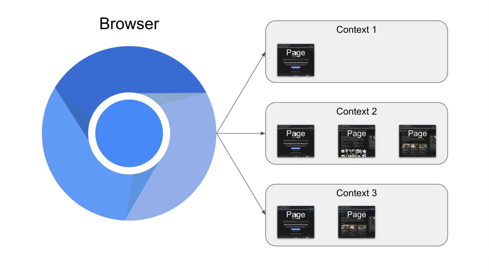

# tau-playwright-workshop

This repository contains the example code for the Playwright workshop
for [TAU: The Homecoming](https://applitools.com/tau-homecoming/)
on December 1, 2021.
The workshop will be done in [Python](python.org).

This README contains full instructions for the workshop.
That way, you can still code along to learn Playwright even if you miss the main event!


## Workshop details

This section contains information about the workshop.


### Abstract

[Playwright](https://playwright.dev/python/)
is a hot new browser automation tool from Microsoft.
With bindings for .NET, Java, JavaScript, and Python, it’s a strong alternative to Selenium WebDriver for end-to-end web app testing.

This workshop will be an introduction to Playwright using [Python](python.org).
We will automate a test scenario together that performs a [DuckDuckGo](https://duckduckgo.com/) search.
As we code along the test together, we will learn:

* How to install and configure Playwright
* How to integrate Playwright with [pytest](pytest.org), Python’s leading test framework
* How to perform interactions through page objects
* How to conveniently run different browsers, capture videos, and run tests in parallel

Come prepared with Python 3.7 or higher installed on your machine.
By the end of the workshop, you will have a solid foundation in Playwright as well as a Python project you can extend with new tests!


### Prerequisites

To code along with this workshop, your machine must have Python 3.7 or higher.
You should also have a decent Python editor like
[Visual Studio Code](https://code.visualstudio.com/docs/languages/python)
or [PyCharm](https://www.jetbrains.com/pycharm/).

The command line shown in examples below is [bash](https://en.wikipedia.org/wiki/Bash_(Unix_shell)).
If you are using a different shell or a Windows command line, some commands may need to be different.


### Agenda

This workshop has five main parts:

1. Getting started
   1. What is Playwright?
   2. Our web search test
   3. Test project setup
2. First steps with Playwright
   1. Raw Playwright calls
3. Refactoring using page objects
   1. The search page
4. Writing assertions
   1. Checking the search field
   2. Checking the result links
   3. Checking the title
5. Nifty Playwright tricks
   1. Testing different browsers
   2. Capturing screenshots and videos
   3. Running tests in parallel


### Example code branches

Each part has a corresponding branch in this repository containing the part's example code.
The branches allow you to check your progress at any point during the workshop.
The branch names are:

| Part   | Branch              |
| ------ | ------------------- |
| Start  | 0-initial-project   |
| Part 1 | 1-getting-started   |
| Part 2 | 2-raw-playwright    |
| Part 3 | 3-page-objects      |
| Part 4 | 4-assertions        |
| Part 5 | 5-playwright-tricks |


## Workshop parts

This section contains the instructions for completing the workshop.
You can code along with them either during the live workshop event or afterwards on your own.


### Part 1: Getting started


#### What is Playwright?

[Playwright](https://playwright.dev/python/) is a new library that can automate interactions with Chromium, Firefox, and WebKit browsers via a single API.
It is an open source project developed by Microsoft.

Playwright is a fantastic alternative to [Selenium WebDriver](https://www.selenium.dev/) for web UI testing.
Like Selenium WebDriver, Playwright has language bindings in multiple languages: Python, .NET, Java, and JavaScript.
Playwright also refines many of the pain points in Selenium WebDriver.
Some examples include:

* Playwright interactions automatically wait for elements to be ready.
* Playwright can use one browser instance with multiple browser contexts for isolation instead of requiring multiple instances.
* Playwright has device emulation for testing responsive web apps in mobile browsers.

For a more thorough list of advantages, check out
[Why Playwright?](https://playwright.dev/python/docs/why-playwright/)
from the docs.


#### Our web search test

For this workshop, we will walk through one test scenario for DuckDuckGo searching.
[DuckDuckGo](https://duckduckgo.com/) is a search engine like Google or Yahoo.

The steps for a basic DuckDuckGo search are:

```gherkin
Given the DuckDuckGo home page is displayed
When the user searches for a phrase
Then the search result query is the phrase
And the search result links pertain to the phrase
And the search result title contains the phrase
```

Go to [duckduckgo.com](https://duckduckgo.com/) and give this a try.
You can use any search phrase you like.
It is important to write a test *case* before writing test *code*.
It is also important to try a test manually before attempting to automate it.


#### Test project setup

Let's set up the test project!
For this workshop, we will build a new project from the ground up.
The GitHub repository should be used exclusively as a reference for example code.

Create a directory named `tau-playwright-workshop` for the project:

```bash
$ mkdir tau-playwright-workshop
$ cd tau-playwright-workshop
```

Inside this project, create a [Python virtual environment](https://docs.python.org/3/tutorial/venv.html)
using the [venv](https://docs.python.org/3/library/venv.html) module
to manage dependency packages locally:

```bash
$ python3 -m venv venv
$ source venv/bin/activate
```

Creating a new virtual environment for each Python project is a recommended practice.
This command will create a subdirectory named `venv` that holds all virtual environment files, including dependency packages.
After creating a virtual environment, you must "activate" it to use it using the `source` command shown above.
You can tell if a virtual environment is active if its name appears in the bash prompt.

*A note about Python commands:*
Python has two incompatible major versions: 2 and 3.
Although Python 2 end-of-life was January 1, 2020, many machines still run it.
For example, macOS comes bundled with Python 2.7.18.
Sometimes, the `python` executable may point to Python 2 instead of 3.
To be precise about versions and executables, we will use the `python3` and `pip3` commands explicitly in this workshop.

Let's add some Python packages to our new virtual environment:

```bash
$ pip3 install playwright
$ pip3 install pytest
$ pip3 install pytest-playwright
```

By itself, Playwright is simply a library for browser automation.
We need a test framework like pytest if we want to automate tests.
The [`pytest-playwright`](https://playwright.dev/python/docs/test-runners)
is a pytest plugin developed by the Playwright team that simplifies Playwright integration.

You can check all installed packages using `pip3 freeze`.
They should look something like this:

```bash
$ pip3 freeze
attrs==21.2.0
greenlet==1.1.2
iniconfig==1.1.1
packaging==21.3
playwright==1.17.0
pluggy==1.0.0
py==1.11.0
pyee==8.2.2
pyparsing==3.0.6
pytest==6.2.5
toml==0.10.2
websockets==10.1
```

Notice that pip fetches dependencies of dependencies.
It is customary for Python projects to store this list of dependencies in a file named `requirements.txt`.

After the Python packages are installed, we need to install the browsers for Playwright.
The `playwright install` command installs the latest versions of the three browsers that Playwright supports:
Chromium, Firefox, and WebKit:

```bash
$ playwright install
```

By default, pytest with the Playwright plugin will run headless Chromium.
We will show how to run against other browsers in Part 5.

Finally, let's create a test function stub.
By Python conventions, all tests should be located under a `tests` directory.
Create a `tests` directory, and inside, create a file named `test_search.py`:

```bash
$ mkdir tests
$ touch tests/test_search.py
```

Add the following code to `tests/test_search.py`:

```python
def test_basic_duckduckgo_search():
    # Given the DuckDuckGo home page is displayed
    # When the user searches for a phrase
    # Then the search result query is the phrase
    # And the search result links pertain to the phrase
    # And the search result title contains the phrase
    pass
```

The `test_basic_duckduckgo_search` is merely a stub, but it establishes good practices:

* It has a clear name.
* It defines the behavior to test step-by-step in its comments.
* It can be run immediately.

The `pass` statement at the end is just a no-op.

Remember, write test *cases* before you write test *code*.

Before continuing, run this test to make sure everything is set up correctly:

```bash
$ python3 -m pytest tests
```

pytest should discover, run, and pass the single test case under the `tests` directory.

*A note about the pytest command:*
Many online articles and examples use the `pytest` command directly to run tests, like this: `pytest tests`.
Unfortunately, this version of the command does **not** add the current directory to the Python path.
If your tests reference anything outside of their test modules, then the command will fail.
Therefore, I always recommend running the full `python3 -m pytest tests` command.


### Part 2: First steps with Playwright

Before we can automate interactions using Playwright's API, we must first understand how Playwright interacts with browsers.
There are three main layers to automation: *browsers*, *browser contexts*, and *pages*:

1. A [browser](https://playwright.dev/python/docs/browsers/)
   is a single instance of a web browser.
   Playwright will automatically launch a browser instance specified by code or by inputs.
   Typically, this is either the Chromium, Firefox, or WebKit instance installed via `playwright install`,
   but it may also be other browsers installed on your local machine.
2. A [browser context](https://playwright.dev/python/docs/browser-contexts/)
   is an isolated incognito-alike session within a browser instance.
   They are fast and cheap to create.
   One browser may have multiple browser contexts.
   The recommended practice is for all tests to share one browser instance but for each test to have its own browser context.
3. A [page](https://playwright.dev/python/docs/pages/)
   is a single tab or window within a browser context.
   A browser context may have multiple pages.
   Typically, an individual test should interact with only one page.

Below is a diagram illustrating how these three pieces work together:




TBD

* pytest fixtures
* Playwright API
* load a page
* fill and click
* run


### Part 3: Refactoring using page objects

TBD


### Part 4: Writing assertions

TBD


### Part 5: Nifty Playwright tricks

TBD
