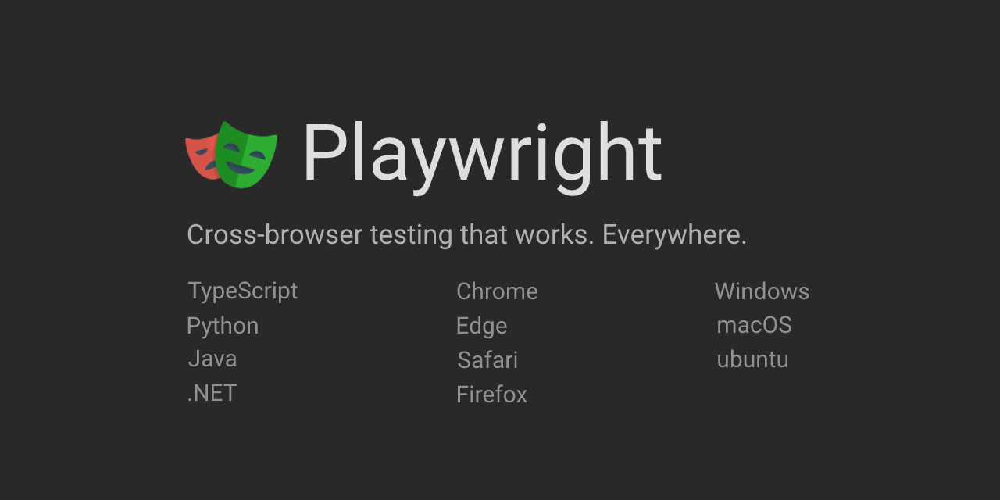

# Tutorial: Web Testing with Playwright in Python

*Warning: Many parts of this tutorial have fallen out of date. I hope to update it sometime in the future.*

## Abstract

Everybody gets frustrated when web apps are broken,
but testing them thoroughly doesn't need to be a chore.
[Playwright](https://playwright.dev/python/),
a new open-source browser automation tool from Microsoft,
makes testing web apps fun!
Playwright outperforms other browser automation with a slew of nifty features
like automatic waiting, mobile emulation, and network interception.
Plus, with isolated browser contexts,
Playwright tests can set up *much* faster than traditional Web UI tests.

In this tutorial, we will build a [Python](https://www.python.org/)
test automation project from the ground up using Playwright.
We will automate web tests together step-by-step
using Playwright for interactions and pytest for execution.
We'll also explore Playwright tricks
like cross-browser testing, capturing videos, and even running tests in parallel!
By the end of this tutorial, you'll be empowered to test modern web apps with modern web test tools.
You'll also have an example project to be the foundation for your future tests.

## What is Playwright?

Playwright is a fairly new test automation framework from Microsoft.
It is open source, and it has bindings in TypeScript/JavaScript, Python, .NET, and Java.
Some of the nice features Playwright offers include:

* concise, readable calls
* easy out-of-the-box setup
* very fast execution times (compared to other browser automation tools)
* cross-browser and mobile emulation support
* automatic waiting
* screenshots and video capture
* built-in API calls

Microsoft is actively developing Playwright,
so new features are coming all the time!

## Tutorial Instructions

You can take this tutorial independently by following the instructions
in this `README` and in the [`tutorial`](tutorial) folder.
Feel free to open issues against this repository if you have any trouble completing the tutorial independently.

I also have given (or will be giving) this tutorial as a live workshop at the following events:

* [TAU: The Homecoming](https://applitools.com/on-demand-videos/tau-the-homecoming-2021/) (December 1, 2021)
* [Python Web Conference 2022](https://2022.pythonwebconf.com/tutorials/end-to-end-testing-with-playwright) (March 22, 2022)
* [STAREast 2022](https://stareast.techwell.com/program/tutorials/web-ui-testing-playwright-python-stareast-2022) (April 26, 2022)
* [PyCon US 2022](https://us.pycon.org/2022/schedule/presentation/35/) (April 28, 2022)

## Outline

This tutorial has six main parts, each with three sections:

1. Getting started
   1. What is Playwright?
   2. Our web search test
   3. Test project setup
2. First steps with Playwright
   1. Browsers, contexts, and pages
   2. Navigating to a web page
   3. Performing a search
3. Writing assertions
   1. Checking the search field
   2. Checking the result links
   3. Checking the title
4. Refactoring using page objects
   1. The search page
   2. The result page
   3. Page object fixtures
5. Nifty Playwright tricks
   1. Testing different browsers
   2. Capturing screenshots and videos
   3. Running tests in parallel
6. Testing with APIs
   1. API setup
   2. Writing a pure API test
   3. Writing a hybrid UI/API test

## Prerequisites

You must have basic Python programming skills to complete this tutorial.
If you are new to Python, check out the free
[Python Programming](https://testautomationu.applitools.com/python-tutorial/) course
on Test Automation University.

Your machine must also have Python 3.7 or higher installed.
You can download the latest version of Python from [Python.org](https://www.python.org/).

You should also have a decent Python editor like
[Visual Studio Code](https://code.visualstudio.com/docs/languages/python)
or [PyCharm](https://www.jetbrains.com/pycharm/).

If you wish to complete Part 6 ("Testing with APIs"),
then you will need a [GitHub](https://github.com/) account.

## Example code branches

Each tutorial part has a corresponding branch in this repository containing the part's example code and `tutorial` instructions.
The branches allow you to check your progress at any point during the tutorial.
The branch names are:

| Part     | Branch              |
| ------   | ------------------- |
| Start    | 0-initial-project   |
| Part 1   | 1-getting-started   |
| Part 2   | 2-first-steps       |
| Part 3   | 3-assertions        |
| Part 4   | 4-page-objects      |
| Part 5   | 5-playwright-tricks |
| Part 6   | 6-api-testing       |
| Complete | main                |
