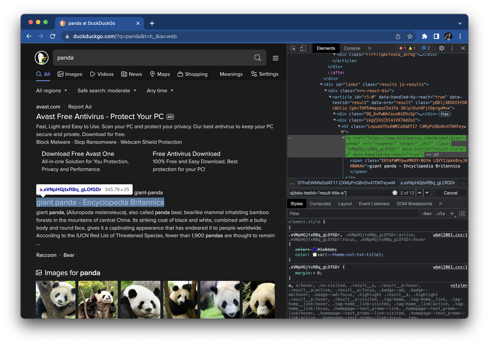

# Part 3: Writing assertions

Part 3 of the tutorial focuses on making assertions about the result page after performing a search.
Waiting becomes a much bigger concern for these steps, but Playwright makes it easy.


## Checking the search field

After performing a search, our test case must check three things on the result page.
According to the step, "Then the search result query is the phrase",
the first thing to check is that the search input field at the top of the result page contains the search phrase.

Here's the inspection panel for the search input element on the result page:


This element also has an ID,
so we can use the `#search_form_input` selector to uniquely identify it.

To verify the textual value inside this input element,
we should use Playwright's `expect` function.
`expect` connects page and locator calls to Playwright's assertions.

Import the `expect` function like this:

```python
    from playwright.sync_api import expect, Page
```

Then, add the following line to the test case:

```python
    expect(page.locator('#search_form_input')).to_have_value('panda')
```

This line will get the input value from the target element and assert that it is equal to the original search phrase.

The full test case should now look like this:

```python
from playwright.sync_api import expect, Page

def test_basic_duckduckgo_search(page: Page) -> None:

    # Given the DuckDuckGo home page is displayed
    page.goto('https://www.duckduckgo.com')

    # When the user searches for a phrase
    page.fill('#search_form_input_homepage', 'panda')
    page.click('#search_button_homepage')

    # Then the search result query is the phrase
    expect(page.locator('#search_form_input')).to_have_value('panda')

    # And the search result links pertain to the phrase
    # And the search result title contains the phrase
    pass
```

Hold on, do we have a race condition here?
After calling `page.click(...)`, the browser will load the result page,
but elements on the result page need time to be ready for interaction.
Our test does nothing explicit to wait for the result page to load before trying to interact with the search input element.
Is this a problem?

Thankfully, in this case, there is no problem.
Playwright automatically waits for elements to be ready before interacting with them.
So, even though the test does not perform any *explicit* waiting for the result page,
the `expect` function performs *implicit* waiting for the element to satisfy the `to_have_value` condition.
Check the [Auto-waiting](https://playwright.dev/python/docs/actionability) page
for a full list of actionability checks for each interaction.

> You could use the following assert statement for this verification:
>  
> `assert 'panda' == page.input_value('#search_form_input')`
>  
> However, while this call will wait for the element to appear,
> it will not wait for the input value to become `'panda'`.
> The recommended practice is to use `expect` with locator objects.

Rerun the test using the same pytest command (`python3 -m pytest tests --headed --slowmo 1000`).
This time, you should see the result page for a good second or two before the browser window closes.
The test should still pass.


## Checking the result links

The next test step is, "And the search result links pertain to the phrase".
It makes sure that the result links returned actually relate to the search phrase entered.
An easy way to check this is to make sure the phrase appears in some of the result link titles.
This will only work for simple phrases (one or two words with no punctuation),
and not every result link may have a match.
Nevertheless, our test is a basic search test,
so its scope should cover only the most basic aspects of searching behavior.
We would need to write other, more advanced tests if we wanted to use sharper assertions.

Typically, elements in a list share a common DOM structure and common CSS classes.
Here's the inspection panel for result links:



Result links are `a` elements with a `data-testid` attribute set to `"result-title-a"`.
We could use the CSS selector `a[data-testid="result-title-a"]` to identify all result links on the page.
(If you look in the DevTools search bar, you'll see that this selector locates 12 elements.)

Since we can get all elements with one selector,
we can take the following steps to verify that search result links pertain to the phrase:

1. Wait for the first few result links to appear on the page.
2. Scrape the text contents of the result link titles.
3. Filter the titles that contain the search phrase.
4. Verify that the list of filtered titles is nonempty.

In this case, we *must* do explicit waiting for multiple result links to appear.
If we try to get text contents without waiting for all targets to appear, then some (or all) might be left out!
This risk is small, but it is nonzero.
Always safely mitigate potential race conditions with proper waiting.

Explicit waiting will be tricky.
Add the following line to the test:

```python
    page.locator('a[data-testid="result-title-a"]').nth(4).wait_for()
```

Let's break this down:

1. [`locator`](https://playwright.dev/python/docs/api/class-page#page-locator) is a method that returns a
   [`Locator`](https://playwright.dev/python/docs/api/class-locator) object for the target element.
   A `Locator` object can make many of the same calls as a page, like clicking and getting text.
   However, it can also make calls for explicit waiting and calls that target multiple elements.
2. `a[data-testid="result-title-a"]` is the selector for the result links.
3. `nth(4)` is an [N-th element](https://playwright.dev/python/docs/api/class-locator#locator-nth) fetcher.
   N-th element fetchers are zero-indexed and may be appended to any selector.
   In this call, it will fetch the fifth result link element.
4. [`wait_for`](https://playwright.dev/python/docs/api/class-locator#locator-wait-for)
   is a method that will wait for the target element to be visible.

In summary, this line will wait for the fifth result link to become visible on the page.
Why check for the fifth?
Most DuckDuckGo searches return ten links, but sometimes, they return fewer.
Waiting for five links to appear should be good enough for our testing purposes.

After the links appear, we can scrape their text contents like this:

```python
    titles = page.locator('a[data-testid="result-title-a"]').all_text_contents()
```

Again, we must use the `locator` method because we want to target a list of elements instead of one.
This selector does *not* include the N-th element selector because we want to target all result links.
The [`all_text_contents`](https://playwright.dev/python/docs/api/class-locator#locator-all-text-contents) method
returns a list containing the text content of each located element.
After this call, `titles` will be a list of strings of the titles we need to check!

Next, we can filter the list of titles to find the ones that contain the search phrase.
For proper comparisons, the titles and the search phrase should all be lowercase.
Add this line to the test:

```python
    matches = [t for t in titles if 'panda' in t.lower()]
```

This is a Python [list comprehension](https://docs.python.org/3/tutorial/datastructures.html#list-comprehensions).
Basically, it filters `titles` for elements that contain the search phrase.
If the lowercase version of a title contains the search phrase, then it is added to `matches`.
Otherwise, it is omitted.

In the best case, all titles will match.
However, in the real world, some titles may not include the full search phrase.
Since ours is merely a basic search test, it should verify that at least one title matches.
Add this assertion to the test:

```python
    assert len(matches) > 0
```

The full test case should now look like this:

```python
from playwright.sync_api import expect, Page

def test_basic_duckduckgo_search(page: Page) -> None:
    
    # Given the DuckDuckGo home page is displayed
    page.goto('https://www.duckduckgo.com')

    # When the user searches for a phrase
    page.locator('#search_form_input_homepage').fill('panda')
    page.locator('#search_button_homepage').click()

    # Then the search result query is the phrase
    expect(page.locator('#search_form_input')).to_have_value('panda')

    # And the search result links pertain to the phrase
    page.locator('a[data-testid="result-title-a"]').nth(4).wait_for()
    titles = page.locator('a[data-testid="result-title-a"]').all_text_contents()
    matches = [t for t in titles if 'panda' in t.lower()]
    assert len(matches) > 0

    # And the search result title contains the phrase
    pass
```

This step had the most complex code so far, but it still wasn't too bad.
Rerun the test to make sure things still pass.


## Checking the title

The final test step is, "And the search result title contains the phrase".
Thankfully, this one will be short.

The page title is an attribute of the page.
It is not associated with any element on the page.
We can use the [`title`](https://playwright.dev/python/docs/api/class-page#page-title) method to access it directly.
For assertions, we should use `expect` with the `to_have_title` condition.

Add the following line to the test:

```python
    expect(page).to_have_title('panda at DuckDuckGo')
```

This will make sure the search phrase appears in the page title.
Be cautious about when to check the page title.
Make sure the page is fully loaded first.

The full test case should now look like this:

```python
from playwright.sync_api import expect, Page

def test_basic_duckduckgo_search(page: Page) -> None:
    
    # Given the DuckDuckGo home page is displayed
    page.goto('https://www.duckduckgo.com')

    # When the user searches for a phrase
    page.locator('#search_form_input_homepage').fill('panda')
    page.locator('#search_button_homepage').click()

    # Then the search result query is the phrase
    expect(page.locator('#search_form_input')).to_have_value('panda')

    # And the search result links pertain to the phrase
    page.locator('a[data-testid="result-title-a"]').nth(4).wait_for()
    titles = page.locator('a[data-testid="result-title-a"]').all_text_contents()
    matches = [t for t in titles if 'panda' in t.lower()]
    assert len(matches) > 0

    # And the search result title contains the phrase
    expect(page).to_have_title('panda at DuckDuckGo')
```

We can remove the `pass` statement at the end now.

Rerun the test again to make sure it works.
If it does, congrats!
You have just completed a full test case in Python using Playwright with pytest.

Notice how concise this code is.
Unfortunately, it's not very reusable.
If other tests needed to perform DuckDuckGo searches,
they would duplicate similar calls.
In the next tutorial part, we will refactor this test using page objects to make the code more reusable and extendable.
