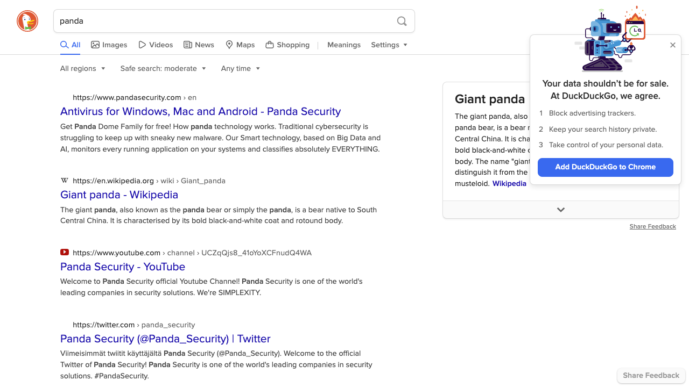

# Part 5: Nifty Playwright tricks

Now that we have a complete test case, we can use it to explore some of Playwright's nifty features.
Part 5 of this tutorial will explore various things like testing different browsers, capturing images, and running tests in parallel.
Check the [Pytest plugin](https://playwright.dev/python/docs/test-runners) page
in the Playwright docs to learn even more advanced tricks after this tutorial.


## Testing different browsers

So far, we have done all of our testing using Chromium, which is the default browser for Playwright.
Testing Firefox and WebKit, the other two browsers bundled with Playwright, is as easy as adding a commmand line option.
Use the `--browser` option with the `pytest-playwright` plugin like this:

```bash
$ python3 -m pytest tests --browser chromium
$ python3 -m pytest tests --browser firefox
$ python3 -m pytest tests --browser webkit
```

Give these a try and see what happens.
You may want to append `--headed --slowmo 1000` so you can actually see the automation at work.

You can also run tests against multiple browsers at the same time.
Just add as many `--browser` options as you want to the same invocation.
Pytest will treat each browser as a test case parameter.
For example, you can run all three browsers like this:

```bash
$ python3 -m pytest tests --browser chromium --browser firefox --browser webkit --verbose
```

The extra `--verbose` option is not necessary,
but adding it will make pytest list each test result with its browser so you can see the parameterization.

Sometimes, for whatever reason, you may want to test against stock browsers on your machine instead of Chromium, Firefox, or WebKit.
Playwright enables you to test Google Chrome and Microsoft Edge through
[browser channels](https://playwright.dev/python/docs/browsers/#google-chrome--microsoft-edge).
Use the `--browser-channel` option like this:

```bash
$ python3 -m pytest tests --browser-channel chrome
$ python3 -m pytest tests --browser-channel msedge
```

Unfortunately, at the time of developing this tutorial (March 2022),
Playright does not support channels for browsers other than Chrome and Edge.

Playwright also allows you to emulate mobile devices to test responsive layouts.
The full list of available devices is
[here](https://github.com/microsoft/playwright/blob/master/packages/playwright-core/src/server/deviceDescriptorsSource.json),
and it's quite long!
To test one of these devices, use the `--device` option like this:

```bash
$ python3 -m pytest tests --device "iPad Mini"
$ python3 -m pytest tests --browser webkit --device "iPhone 11"
$ python3 -m pytest tests --browser chromium --device "Pixel 5"
```

Give it a try with `--headed --slowmo 1000` to see the drastically different screen sizes.


## Capturing screenshots and videos

While developing automated tests,
we typically run them headed in slow motion so that we can see exactly what our test code does.
However, when we run tests "for real" in a Continuous Integration system or on a regular schedule,
we are not present in the moment of a failure to see exactly what went wrong.
We rely on test reports, logs, and other artifacts to provide the information needed for root cause analysis.
Since web UI tests are inherently visual,
artifacts like screenshots and videos can be invaluable for determining failure reasons.
A picture is truly worth a thousand words!

You can capture screenshots at any time using the
[screenshot](https://playwright.dev/python/docs/api/class-page#page-screenshot) method.
However, the most valuable screenshots to capture are typically the ones that happen at the moment of failure.
When a test fails, these happen at the end of the test.
The `pytest-playwright` plugin provides a `--screenshot` option that will capture screenshots at the end of each test.
By default, this option is set to `off`, but you can turn it `on` like this:

```bash
$ python3 -m pytest tests --screenshot on
```

This will capture a screenshot after every test.
Give it a try!
Playwright will save screenshots as PNG files under a directory named `test-results`.
You can change the output directory using the `--output` option.

The screenshot should look like this:



Try capturing screenshots with different browsers and devices.
(Please note that Playwright will delete all old results in the output folder before each run.)

Even though individual screenshot files may be small,
screenshots can add up over time to become a very large data storage burden.
Imagine a large test suite running thousands of tests daily.
Saving a screenshot for every test becomes impractical.
Instead of using `on` to save a screenshot for every test,
use `only-on-failure` to save a screenshot for every *failing* test only:

```bash
$ python3 -m pytest tests --screenshot only-on-failure
```

If you run this command, then you should not get a screenshot for the `test_basic_duckduckgo_search`
because it should pass.

What could be better than automatic screenshots for tests?
How about *videos*!
If a picture is worth a thousand words, then a video recording must be worth a million.
Yet again, the `pytest-playwright` plugin makes automation easy by providing an option named `--video`.
By default, this option is set to `off`,
but we can set it to `on` to save a video recording for every test,
or we can set it to `retain-on-failure` to save video recordings only for failed tests.

Give video recording a try with this command:

```bash
$ python3 -m pytest tests --video on
```

Playwright saves videos as [WebM](https://en.wikipedia.org/wiki/WebM) files in the output directory.

Just like with screenshots, saving videos for every test becomes imprudent over time.
It is recommended to use the `retain-on-failure` option:

```bash
$ python3 -m pytest tests --video retain-on-failure
```


## Running tests in parallel

Even though Playwright is pretty fast (especially compared to Selenium WebDriver),
running tests one at a time becomes very slow for large test suites.
Individual tests can only be optimized so far.
Running tests in parallel becomes a necessity.

While Playwright does not provide parallel execution capabilities on its own,
we can use the `pytest-xdist` plugin to run tests in parallel,
and we can rely on Playwright browser contexts and pages to keep tests isolated.

Install `pytest-xdist` via pip:

```bash
$ pip3 install pytest-xdist
```

Let's parameterize our test so that we have multiple test to run in parallel.
Change the code in `tests/test_search.py` to match the following:

```python
import pytest

from pages.result import DuckDuckGoResultPage
from pages.search import DuckDuckGoSearchPage
from playwright.sync_api import expect, Page


ANIMALS = [
    'panda',
    'python',
    'polar bear',
    'parrot',
    'porcupine',
    'parakeet',
    'pangolin',
    'panther',
    'platypus',
    'peacock'
]


@pytest.mark.parametrize('phrase', ANIMALS)
def test_basic_duckduckgo_search(
    phrase: str,
    page: Page,
    search_page: DuckDuckGoSearchPage,
    result_page: DuckDuckGoResultPage) -> None:
    
    # Given the DuckDuckGo home page is displayed
    search_page.load()

    # When the user searches for a phrase
    search_page.search(phrase)

    # Then the search result query is the phrase
    expect(result_page.search_input).to_have_value(phrase)

    # And the search result links pertain to the phrase
    assert result_page.result_link_titles_contain_phrase(phrase)

    # And the search result title contains the phrase
    expect(page).to_have_title(f'{phrase} at DuckDuckGo')
```

The test is the same, but now it is parameterized to use ten different search phrases.

Try running these new tests serially to see how long they take.
Then, try running them in parallel using `pytest-xdist`'s `-n` option.
The number you give with `-n` specifies the degree of concurrency.
For example, you can run 2 tests in parallel like this:

```bash
$ python3 -m pytest tests -n 2
```

Typically, the optimal degree of concurrency is the number of processors or cores on your machine.
Try running these tests in parallel at different degrees of concurrency (2, 3, 4, 5, higher?)
to find the fastest completion time.

> *Warning:* DuckDuckGo may throttle your tests' requests if they happen too quickly.
> To work around this problem, try running with `--headed` or with `--slowmo 100`.)

You can also test multiple browsers in parallel.
For example, the following command will run the parameterized tests against all three Playwright browsers at 5x parallel:

```bash
$ python3 -m pytest tests -n 5 --browser chromium --browser firefox --browser webkit
```
