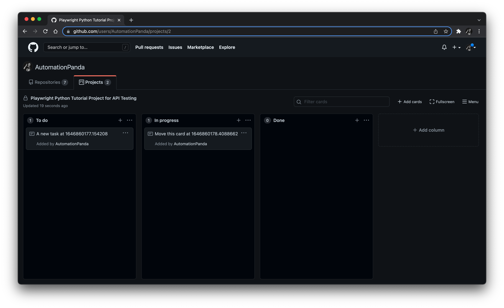

# Part 6: API testing

Did you know that Playwright has support for built-in
[API testing](https://playwright.dev/python/docs/api-testing)? 
While you could use Playwright for purely testing APIs,
this feature shines when used together with web UI testing.

In this part, we will learn how to use Playwright's API testing features by automating tests
for [GitHub project boards](https://docs.github.com/en/issues/organizing-your-work-with-project-boards).
These tests will be more complex than our previous DuckDuckGo search test.
They will make multiple calls to the [GitHub API](https://docs.github.com/en/rest) with authentication.
The first test will *create* a new project card purely from the GitHub API,
and the second test will *move* a project card from one column to another.




## API setup

Before we can develop tests for GitHub project boards,
we need to set up a few things:

1. A GitHub account
2. A GitHub user project
3. A GitHub personal access token

Pretty much every developer these days already has a GitHub account,
but not every developer may have set up a project board in GitHub.
Follow the [user project instructions](https://docs.github.com/en/issues/organizing-your-work-with-project-boards/managing-project-boards/creating-a-project-board#creating-a-user-owned-project-board)
to create a user project.
Create a "classic" project and not a *Beta* project.
Use the "Basic Kanban" template – the project must have at least two columns.
The project may be public or private,
but I recommend making it private if you intend to use it only for this tutorial.

GitHub API calls require a *personal access token* for authentication.
GitHub no longer supports "basic" authentication with username and password.
Follow the [personal access token instructions](https://docs.github.com/en/authentication/keeping-your-account-and-data-secure/creating-a-personal-access-token)
to create a personal access token.
Select the **repo** and **user** permissions.
Remember to copy and save your token somewhere safe,
because you won't be able to view it again!

The tests also need the following four inputs:

1. Your GitHub username
2. Your GitHub password (for UI login)
3. Your GitHub personal access token (for API authentication)
4. Your GitHub user project name

Let's set these inputs as environment variables
and read them into tests using pytest fixtures.
Environment variables must be set before launching tests.

On macOS or Linxu, use the following commands:

```bash
$ export GITHUB_USERNAME=<github-username>
$ export GITHUB_PASSWORD=<github-password>
$ export GITHUB_ACCESS_TOKEN=<github-access-token>
$ export GITHUB_PROJECT_NAME="<github-project-name>"
```

On Windows:

```console
> set GITHUB_USERNAME=<github-username>
> set GITHUB_PASSWORD=<github-password>
> set GITHUB_ACCESS_TOKEN=<github-access-token>
> set GITHUB_PROJECT_NAME="<github-project-name>"
```

> *Warning:*
> Make sure to keep these values secure.
> Do not share your password or access token with anyone.

We should read these environment variables through pytest fixtures
using the [`os`](https://docs.python.org/3/library/os.html) module
so that any test can easily access them.
Add the following function for reading environment variables to `tests/conftest.py`:

```python
import os

def _get_env_var(varname: str) -> str:
    value = os.getenv(varname)
    assert value, f'{varname} is not set'
    return value
```

This function will not only read an environment variable by name
but also make sure the variable has a value.
Then, add fixtures for each environment variable:

```python
@pytest.fixture(scope='session')
def gh_username() -> str:
    return _get_env_var('GITHUB_USERNAME')

@pytest.fixture(scope='session')
def gh_password() -> str:
    return _get_env_var('GITHUB_PASSWORD')

@pytest.fixture(scope='session')
def gh_access_token() -> str:
    return _get_env_var('GITHUB_ACCESS_TOKEN')

@pytest.fixture(scope='session')
def gh_project_name() -> str:
    return _get_env_var('GITHUB_PROJECT_NAME')
```

Now, our tests can safely and easily fetch these variables.
These fixtures have *session* scope so that pytest will read them only one time during the entire testing session.

The last thing we need is a Playwright request context object tailored to GitHub API requests.
We could build individual requests for each endpoint call,
but then we would need to explicitly set things like the base URL and the authentication token on each request.
Instead, with Playwright, we can build an
[`APIRequestContext`](https://playwright.dev/python/docs/api/class-apirequestcontext)
tailored to GitHub API requests.
Add the following fixture to `tests/conftest.py` to build a request context object for the GitHub API:

```python
from playwright.sync_api import Playwright, APIRequestContext
from typing import Generator

@pytest.fixture(scope='session')
def gh_context(
    playwright: Playwright,
    gh_access_token: str) -> Generator[APIRequestContext, None, None]:

    headers = {
        "Accept": "application/vnd.github.v3+json",
        "Authorization": f"token {gh_access_token}"}

    request_context = playwright.request.new_context(
        base_url="https://api.github.com",
        extra_http_headers=headers)

    yield request_context
    request_context.dispose()
```

Let's break down the code:

1. The `gh_context` fixture has *session* scope because the context object can be shared by all tests.
2. It requires the `playwright` fixture for creating a new context object,
   and it requires the `gh_access_token` fixture we just wrote for getting your personal access token.
3. GitHub API requests require two headers:
   1. An `Accept` header for proper JSON formatting
   2. An `Authorization` header that uses the access token
4. `playwright.request.new_context(...)` creates a new `APIRequestContext` object
   with the base URL for the GitHub API and the headers.
5. The fixture yields the new context object and disposes of it after testing is complete.

Now, any test or other fixture can call `gh_context` for building GitHub API requests!
All requests created using `gh_context` will contain this base URL and these headers by default.


## Writing a pure API test

Our first test will create a new project card exclusively using the [GitHub API](https://docs.github.com/en/rest).
The main part of the test has only two steps:

1. Create a new card on the project board.
2. Retrieve the newly created card to verify that it was created successfully.

However, this test will need more than just two API calls.
Here is the endpoint for creating a new project card:

```
POST /projects/columns/{column_id}/cards
```

Notice that to create a new card with this endpoint,
we need the ID of the target column in the desired project.
The column IDs come from the project data.
Thus, we need to make the following chain of calls:

1. [Retrieve a list of user projects](https://docs.github.com/en/rest/reference/projects#list-user-projects)
   to find the target project by name.
2. [Retrieve a list of project columns](https://docs.github.com/en/rest/reference/projects#list-project-columns)
   for the target project to find column IDs.
3. [Create a project card](https://docs.github.com/en/rest/reference/projects#create-a-project-card)
   in one of the columns using its IDs.
4. [Retrieve the project card](https://docs.github.com/en/rest/reference/projects#get-a-project-card)
   using the card's ID.

> The links provided above for each request document how to make each call.
> They also include example requests and responses.

The first two requests should be handled by fixtures
because they could (and, for our case, *will*) be used for multiple tests.
Furthermore, all of these requests require
[authentication](https://docs.github.com/en/rest/overview/other-authentication-methods)
using your personal access token.

Let's write a fixture for the first request to find the target project.
Add this code to `conftest.py`:

```python
from playwright.sync_api import expect

@pytest.fixture(scope='session')
def gh_project(
    gh_context: APIRequestContext,
    gh_username: str,
    gh_project_name: str) -> dict:

    resource = f'/users/{gh_username}/projects'
    response = gh_context.get(resource)
    expect(response).to_be_ok()
    
    name_match = lambda x: x['name'] == gh_project_name
    filtered = filter(name_match, response.json())
    project = list(filtered)[0]
    assert project

    return project
```

The `gh_project` fixture has *session* scope
because we will treat the project's existence and name as immutable during test execution.
It uses the `gh_context` fixture to build requests with authentication,
and it uses the `gh_username` and `gh_project_name` fixtures for finding the target project.
To get a list of all your projects,
it makes a `GET` request to `/users/{gh_username}/projects` using `gh_context`,
which automatically includes the base URL, headers, and authentication.
The subsequent `expect(response).to_be_ok()` call makes sure the request was successful.
If anything went wrong, tests would abort immediately.

The resulting response will contain a list of *all* user projects.
This fixture then filters the list to find the project with the target project name.
Once found, it asserts that the project object exists and then returns it.

Let's write a fixture for the next request in the call chain to get the list of columns for our project.
Add the following code to `conftest.py`:

```python
@pytest.fixture()
def project_columns(
    gh_context: APIRequestContext,
    gh_project: dict) -> list[dict]:
    
    response = gh_context.get(gh_project['columns_url'])
    expect(response).to_be_ok()

    columns = response.json()
    assert len(columns) >= 2
    return columns
```

The `project_columns` fixture uses *function* scope.
In theory, columns could change during testing,
so each test should fetch a fresh column list.
It uses the `gh_context` fixture for making requests,
and it uses the `gh_project` fixture to get project data.
Thankfully, the project data includes a full endpoint URL to fetch the project's columns: `columns_url`.
This fixture makes a `GET` request on that URL.
Then, it verifies that the project has at least two columns before returning the column data.

This fixture returns the full column data.
However, for testing card creation, we only need a column ID.
Let's make it simple to get column IDs directly with yet another fixture:

```python
@pytest.fixture()
def project_column_ids(project_columns: list[dict]) -> list[str]:
    return list(map(lambda x: x['id'], project_columns))
```

The `project_column_ids` fixture uses the `map` function to get a list of IDs from the list of columns.
We could have fetched the columns and mapped IDs in one fixture,
but it is better to separate them into two fixtures because they represent separate concerns.
Furthermore, while our current test only requires column IDs,
other tests may need other values from column data.

Now that all the setup is out of the way, let's automate the test!
Create a new file named `tests/test_github_project.py`,
and add the following import statement:

```python
import time
from playwright.sync_api import APIRequestContext, Page, expect
```

We'll need the `time` module to grab timestamps.
We'll need the Playwright stuff for type checking and assertions.

Define a test function for our card creation test:

```python
def test_create_project_card(
    gh_context: APIRequestContext,
    project_column_ids: list[str]) -> None:
```

Our test will need `gh_context` to make requests and `project_column_ids` to pick a project column.

Every new card should have a note with a unique message
so that we can find cards when we need to interact with them.
One easy way to create unique messages is to append a timestamp value, like this:

```python
    now = time.time()
    note = f'A new task at {now}'
```

Then, we can create a new card in our project via an API call like this:

```python
    c_response = gh_context.post(
        f'/projects/columns/{project_column_ids[0]}/cards',
        data={'note': note})
    expect(c_response).to_be_ok()
    assert c_response.json()['note'] == note
```

We use `gh_context` to make the `POST` request to the resource.
The column for the card doesn't matter,
so we can choose the first column for simplicity.
Immediately after receiving the response,
we should make sure the response is okay and that the card's note is correct.

Finally, we should verify that the card was actually created successfully
by attempting to `GET` the card using its ID:

```python
    card_id = c_response.json()['id']
    r_response = gh_context.get(f'/projects/columns/cards/{card_id}')
    expect(r_response).to_be_ok()
    assert r_response.json() == c_response.json()
```

The card's ID comes from the previous response.
Again, we use `gh_context` to make the request,
and we immediately verify the correctness of the response.
The response data should be identical to the response data from the creation request.

That completes our API-only card creation test!
Here's the complete code for the `test_create_project_card` test function:

```python
import time
from playwright.sync_api import APIRequestContext, Page, expect

def test_create_project_card(
    gh_context: APIRequestContext,
    project_column_ids: list[str]) -> None:

    # Prep test data
    now = time.time()
    note = f'A new task at {now}'

    # Create a new card
    c_response = gh_context.post(
        f'/projects/columns/{project_column_ids[0]}/cards',
        data={'note': note})
    expect(c_response).to_be_ok()
    assert c_response.json()['note'] == note

    # Retrieve the newly created card
    card_id = c_response.json()['id']
    r_response = gh_context.get(f'/projects/columns/cards/{card_id}')
    expect(r_response).to_be_ok()
    assert r_response.json() == c_response.json()
```

Run the new test module directly:

```bash
$ python3 -m pytest tests/test_github_project.py
```

Make sure all your environment variables are set correctly.
The test should pass very quickly.


## Writing a hybrid UI/API test

Our second test will move a card from one project column to another.
In this test, we will use complementary API and UI interactions to cover this behavior.
Here are our steps:

1. Prep the test data
2. Create a new card (API)
3. Log into the GitHub website (UI)
4. Load the project page (UI)
5. Move the card from one column to another (UI)
6. Verify the card is in the second column (UI)
7. Verify the card change persisted to the backend (API)

Thankfully we can reuse many of the fixtures we created for the previous test.
Even though the previous test created a card, we must create a new card for this test.
Tests can run individually or out of order.
We should not create any interdependencies between individual test cases.

Let's dive directly into the test case.
Add a new test function with all these fixtures:

```python
def test_move_project_card(
    gh_context: APIRequestContext,
    gh_project: dict,
    project_column_ids: list[str],
    page: Page,
    gh_username: str,
    gh_password: str) -> None:
```

Moving a card requires two columns: the source column and the destination column.
For simplicity, let's use the first two columns,
and let's create convenient variables for their IDs:

```python
    source_col = project_column_ids[0]
    dest_col = project_column_ids[1]
```

Just like in the previous test, we should write a unique note for the card to create:

```python
    now = time.time()
    note = f'Move this card at {now}'
```

The code to create a card via the GitHub API is pretty much the same as before, too:

```python
    c_response = gh_context.post(
        f'/projects/columns/{source_col}/cards',
        data={'note': note})
    expect(c_response).to_be_ok()
```

Now, it's time to switch from API to UI.
We need to log into the GitHub website to interact with this new card.
Log into GitHub like this, using fixtures for username and password:

```python
    page.goto(f'https://github.com/login')
    page.locator('id=login_field').fill(gh_username)
    page.locator('id=password').fill(gh_password)
    page.locator('input[name="commit"]').click()
```

These interactions use `Page` methods we saw before in our DuckDuckGo search test.
Then, once logged in, navigate directly to the project page:

```python
    page.goto(f'https://github.com/users/{gh_username}/projects/{gh_project["number"]}')
```

Direct URL navigation is faster and simpler than clicking through elements on pages.
We can retrieve the GitHub project number from the project's data.
(*Warning:* the project number for the URL is different from the project's ID number.)

For safety and sanity, we should check that the first project column has the card we created via API:

```python
    card_xpath = f'//div[@id="column-cards-{source_col}"]//p[contains(text(), "{note}")]'
    expect(page.locator(card_xpath)).to_be_visible()
```

The card XPath is complex.
Let's break it down:

1. `//div[@id="column-cards-{source_col}"]` locates the source column `div` using its ID
2. `//p[contains(text(), "{note}")]` locates a child `p` that contains the text of the target card's note

The assertion is also a bit complex.
Let's break it down, too:

1. `expect(...)` is a special Playwright function for assertions on page locators.
2. `page.locator(card_xpath)` is a web element locator for the target card.
3. `to_be_visible()` is a condition method for the `expect` assertion.
   It verifies that the "expected" locator's element is visible on the page.

Since the locator includes the source column as the parent for the card's paragraph,
asserting its visibility on the page is sufficient for verifying correctness.
If we only checked for the paragraph element without the parent column,
then the test would not detect if the card appeared in the wrong column.
Furthermore, Playwright assertions will automatically wait up to a timeout for conditions to become true.

Now, we can perform the main interaction:
moving the card from one column to another.
Playwright provides a nifty
[`drag_and_drop`](https://playwright.dev/python/docs/api/class-page#page-drag-and-drop) method:

```python
    page.drag_and_drop(f'text="{note}"', f'id=column-cards-{dest_col}')
```

This call will drag the card to the destination column.
Here, we can use a simpler locator for the card because we previously verified its correct placement.

After moving the card, we should verify that it indeed appears in the destination column:

```python
    card_xpath = f'//div[@id="column-cards-{dest_col}"]//p[contains(text(), "{note}")]'
    expect(page.locator(card_xpath)).to_be_visible()
```

Finally, we should also check that the card's changes persisted to the backend.
Let's `GET` that card's most recent data via the API:

```python
    card_id = c_response.json()['id']
    r_response = gh_context.get(f'/projects/columns/cards/{card_id}')
    expect(r_response).to_be_ok()
    assert r_response.json()['column_url'].endswith(str(dest_col))
```

The way to verify the column update is to check the new ID in the `column_url` value.

Here's the completed test code for `test_move_project_card`:

```python
import time
from playwright.sync_api import APIRequestContext, Page, expect

def test_move_project_card(
    gh_context: APIRequestContext,
    gh_project: dict,
    project_column_ids: list[str],
    page: Page,
    gh_username: str,
    gh_password: str) -> None:

    # Prep test data
    source_col = project_column_ids[0]
    dest_col = project_column_ids[1]
    now = time.time()
    note = f'Move this card at {now}'

    # Create a new card via API
    c_response = gh_context.post(
        f'/projects/columns/{source_col}/cards',
        data={'note': note})
    expect(c_response).to_be_ok()

    # Log in via UI
    page.goto(f'https://github.com/login')
    page.locator('id=login_field').fill(gh_username)
    page.locator('id=password').fill(gh_password)
    page.locator('input[name="commit"]').click()

    # Load the project page
    page.goto(f'https://github.com/users/{gh_username}/projects/{gh_project["number"]}')

    # Verify the card appears in the first column
    card_xpath = f'//div[@id="column-cards-{source_col}"]//p[contains(text(), "{note}")]'
    expect(page.locator(card_xpath)).to_be_visible()

    # Move a card to the second column via web UI
    page.drag_and_drop(f'text="{note}"', f'id=column-cards-{dest_col}')

    # Verify the card is in the second column via UI
    card_xpath = f'//div[@id="column-cards-{dest_col}"]//p[contains(text(), "{note}")]'
    expect(page.locator(card_xpath)).to_be_visible()

    # Verify the backend is updated via API
    card_id = c_response.json()['id']
    r_response = gh_context.get(f'/projects/columns/cards/{card_id}')
    expect(r_response).to_be_ok()
    assert r_response.json()['column_url'].endswith(str(dest_col))
```

Run this new test.
If you want to see the browser in action, included the `--headed` option.
The test will take a few seconds longer than the pure API test,
but both should pass!

> *Warning:*
> You might want to periodically archive cards in your GitHub project
> that are created by these tests.

Complementing UI interactions with API calls is a great way to optimize test execution.
Instead of doing all test steps through the UI, which is slower and more prone to race conditions,
certain actions like pre-loading data or verifying persistent changes can be handled with API calls.
