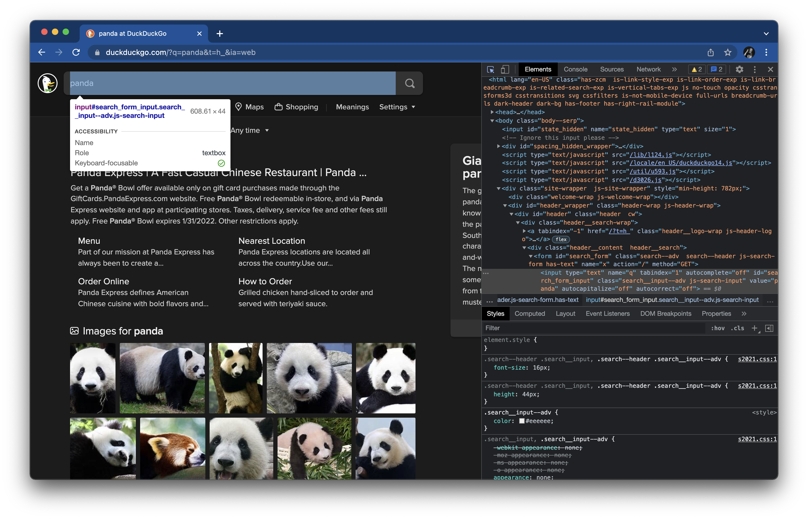

# Part 3: Writing assertions

Part 3 of the workshop focuses on making assertions about the result page after performing a search.
Waiting becomes a much bigger concern for these steps, but Playwright makes it easy.


## Checking the search field

After performing a search, our test case must check three things on the result page.
According to the step, "Then the search result query is the phrase",
the first thing to check is that the search input field at the top of the result page contains the search phrase.

Here's the inspection panel for the search input element on the result page:



This element also has an ID,
so we can use the `#search_form_input` selector to uniquely identify it.

To get the textual value inside this input element,
you might think that we should use the
[`inner_text`](https://playwright.dev/python/docs/api/class-page#page-inner-text) method
or the [`text_content`](https://playwright.dev/python/docs/api/class-page#page-text-content) method.
However, neither of these are correct.
To get the value of an input element, you need to get its `value` attribute.
Thankfully, Playwright provides a convenient method named
[`input_value`](https://playwright.dev/python/docs/api/class-page#page-input-value) to get this.

Add the following line to the test case:

```python
    assert 'panda' == page.input_value('#search_form_input')
```

This line will get the input value from the target element and assert that it is equal to the original search phrase.

The full test case should now look like this:

```python
def test_basic_duckduckgo_search(page):

    # Given the DuckDuckGo home page is displayed
    page.goto('https://www.duckduckgo.com')

    # When the user searches for a phrase
    page.fill('#search_form_input_homepage', 'panda')
    page.click('#search_button_homepage')

    # Then the search result query is the phrase
    assert 'panda' == page.input_value('#search_form_input')

    # And the search result links pertain to the phrase
    # And the search result title contains the phrase
    pass
```

Hold on, do we have a race condition here?
After calling `page.click(...)`, the browser will load the result page,
but elements on the result page need time to be ready for interaction.
Our test does nothing explicit to wait for the result page to load before trying to interact with the search input element.
Is this a problem?

Thankfully, in this case, there is no problem.
Playwright automatically waits for elements to be ready before interacting with them.
So, even though the test does not perform any *explicit* waiting for the result page,
the `input_value` method performs *implicit* waiting for the element to be ready.
Check the [Auto-waiting](https://playwright.dev/python/docs/actionability) page
for a full list of actionability checks for each interaction.

Rerun the test using the same pytest command (`python3 -m pytest tests --headed --slowmo 1000).
This time, you should see the result page for a good second or two before the browser window closes.
The test should still pass.


## Checking the result links

TBD


## Checking the title

TBD
