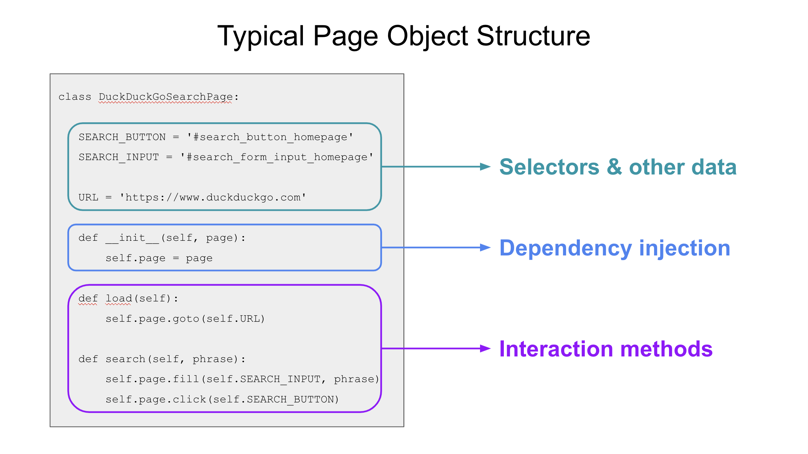

# Refactoring using page objects

As we saw in the previous part, Playwright calls are wonderfully concise.
We may be tempted to use raw Playwright calls in all our tests.
However, raw calls quickly lead to code duplication.

In this part, we will refactor our DuckDuckGo search test using the
[Page Object Model](https://www.selenium.dev/documentation/guidelines/page_object_models/) (POM).
Page objects, though imperfect, provide decent structure and helpful reusability.
They are superior to raw Playwright calls when automating multiple tests instead of only one script.


## The search page

Our search tests interacts with two pages:

1. The DuckDuckGo search page
2. The DuckDuckGo result page

Each page should be modeled by its own class.
Page object classes should be located in a package outside of the `tests` directory so that they can be imported by tests.

Create a new directory named `pages`, and inside it, create blank files with the following names:

* `__init__.py`
* `search.py`
* `result.py`

Your project's directory layout should look like this:

```
tau-playwright-workshop
├── pages
│   ├── __init__.py
│   ├── search.py
│   └── result.py
└── tests
    └── test_search.py
```

The `__init__.py` file turns the `pages` directory into a Python package so that other Python modules can import it.
It will stay permanently empty.
The `search.py` and `result.py` modules will contain the search and result page object classes respectively.

Let's implement the search page first.
We will use much of our original code.

A page object class typically has three main parts:

1. Selectors and any other data stored as variables
2. Dependency injection of the browser automator through a constructor
3. Interaction methods that use the browser automator and the selectors

Let's add these one at a time.
Inside `pages/search.py`, add a class definition for the page object:

```python
class DuckDuckGoSearchPage:
```

Inside this class, add the selectors we used in our test for the search input and search button:

```python
    SEARCH_BUTTON = '#search_button_homepage'
    SEARCH_INPUT = '#search_form_input_homepage'
```

These will be class variables, not instance variables.
They are also plain-old strings.
We could use these selectors for many different actions.

Let's also add the DuckDuckGo URL:

```python
    URL = 'https://www.duckduckgo.com'
```

*(Warning:
Base URLs should typically be passed into automation code as an input, not hard-coded in a page object.
We are doing this here as a matter of simplicity for this workshop.)*

Next, let's handle dependency injection for the browser automator.
Since each test will have its own Playwright page, we should inject that page.
(If we were using Selenium WebDriver, then we would inject the WebDriver instance.)
Add the following initializer method to the class:

```python
    def __init__(self, page):
        self.page = page
```

The `__init__` method is essentially a constructor for Python classes
(but with a bit of nuance that doesn't matter for this workshop).
It has one argument named `page` for the Playwright page,
which it stores as an instance variable (via `self`).

With the page injected, we can now use it to make interactions.
One interaction our test performs is loading the DuckDuckGo search page.
Here's a method to do that:

```python
    def load(self):
        self.page.goto(self.URL)
```

It uses the injected page as well as the `URL` variable.

The other interaction our test performs is searching for a phrase.
Here's a method to do that:

```python
    def search(self, phrase):
        self.page.fill(self.SEARCH_INPUT, phrase)
        self.page.click(self.SEARCH_BUTTON)
```

This `search` method uses the injected page and the selector variables.
It also takes in the search phrase as an argument so that it can handle any phrase.

The completed search page object class should look like this:

```python
class DuckDuckGoSearchPage:

    SEARCH_BUTTON = '#search_button_homepage'
    SEARCH_INPUT = '#search_form_input_homepage'

    URL = 'https://www.duckduckgo.com'

    def __init__(self, page):
        self.page = page
    
    def load(self):
        self.page.goto(self.URL)
    
    def search(self, phrase):
        self.page.fill(self.SEARCH_INPUT, phrase)
        self.page.click(self.SEARCH_BUTTON)
```

This diagram shows how each section of this class fits the standard sections of a page object class:



We can now refactor the original test case to use this new page object!
Replace this old code:

```python
def test_basic_duckduckgo_search(page):

    # Given the DuckDuckGo home page is displayed
    page.goto('https://www.duckduckgo.com')

    # When the user searches for a phrase
    page.fill('#search_form_input_homepage', 'panda')
    page.click('#search_button_homepage')
```

With this new code:

```python
from pages.search import DuckDuckGoSearchPage

def test_basic_duckduckgo_search(page):
    search_page = DuckDuckGoSearchPage(page)

    # Given the DuckDuckGo home page is displayed
    search_page.load()

    # When the user searches for a phrase
    search_page.search('panda')
```

The new code must import `DuckDuckGoSearchPage` from the `pages.search` module.
The test then constructs a `DuckDuckGoSearchPage` object and uses it to perform interactions.
Notice that the test case no longer has hard-coded selectors or URLs.
The code is also more self-documenting.

Rerun the test (`python3 -m pytest tests --headed --slowmo 1000`).
The test should pass.
Nothing has functionally changed for the test:
it still performs the same operations.
Now, it just uses a page object for the search page instead of raw calls.


## The result page


## Page object fixtures
